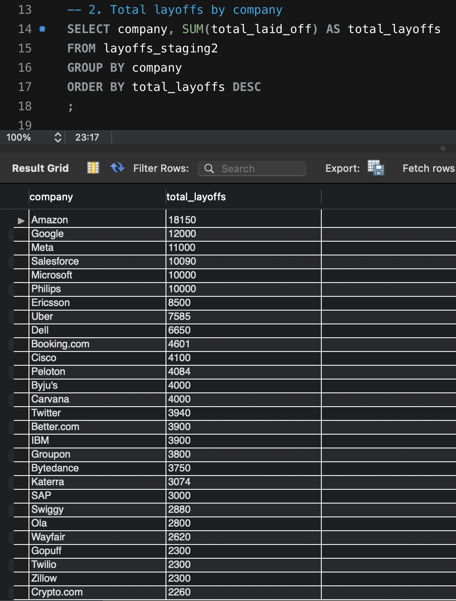
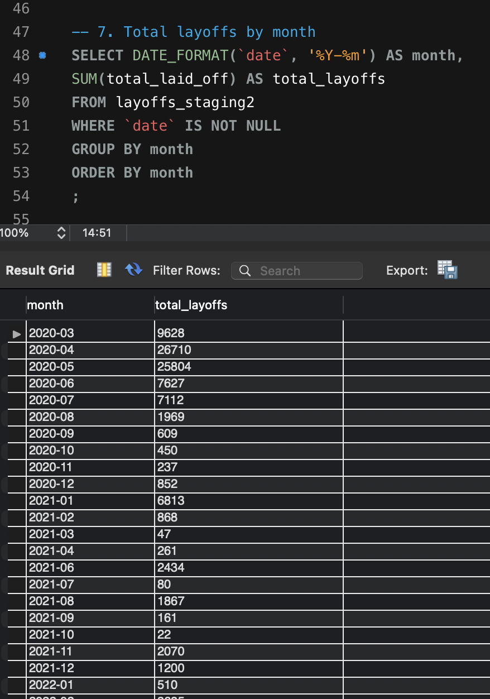
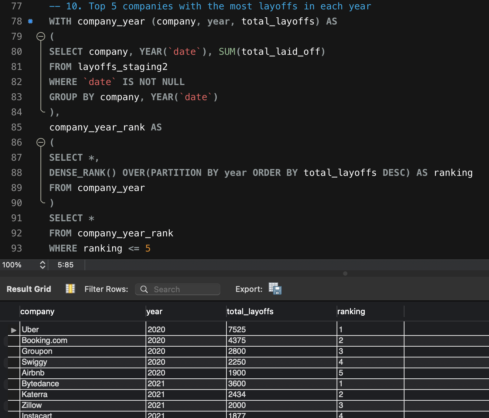

# Global Layoffs SQL Analysis: Data Cleaning and Trend Analysis

## Executive Summary

This project uses SQL to clean and analyze a global layoffs dataset. The goal is to identify which companies, industries, countries, and time periods experienced the highest layoff activity.

After cleaning the raw data in MySQL, I performed exploratory data analysis using aggregation, CTEs, window functions, ranking, and rolling totals. The analysis showed that layoffs were highly concentrated in a small number of companies, industries, and countries.

Amazon had the highest total layoffs with 18,150 layoffs. The Consumer industry had the highest industry-level layoffs with 45,182 layoffs. The United States had the highest country-level layoffs with 256,559 layoffs. By year, 2022 had the highest total layoffs with 160,661 layoffs.

This project demonstrates a full SQL workflow from raw data cleaning to business-focused exploratory analysis.

## Business Problem

Layoff data can help business stakeholders understand workforce risk, industry instability, and broader labor market patterns. For analysts, recruiters, investors, and business decision-makers, identifying layoff trends can provide useful signals about company performance, sector-level pressure, and market uncertainty.

This project focuses on answering the following business questions:

- Which companies had the highest number of layoffs?
- Which industries and countries were most affected?
- Were layoffs concentrated in specific time periods?
- Which companies had the highest layoffs within each year?
- Which companies laid off 100% of employees despite raising large amounts of funding?

## Tools Used

- MySQL
- MySQL Workbench
- SQL

## Dataset

The dataset used in this project comes from a publicly available SQL data cleaning and exploratory analysis tutorial. The raw CSV file is not included in this repository. This project focuses on the SQL workflow, including data cleaning, exploratory analysis, and business-focused interpretation.

## Project Files

| File | Description |
|---|---|
| `01_data_cleaning.sql` | Cleans and prepares the raw layoffs dataset |
| `02_exploratory_data_analysis.sql` | Performs exploratory data analysis using SQL |
| `README.md` | Project overview, methodology, results, and recommendations |
| `screenshots/` | Sample SQL query results |

## Methodology

### 1. Data Cleaning

Before analysis, the raw dataset was cleaned and prepared using SQL. The cleaning process included:

- Created staging tables to protect the original raw data.
- Removed duplicate records using `ROW_NUMBER()` and `PARTITION BY`.
- Standardized company, industry, and country values using `TRIM()` and `UPDATE`.
- Combined inconsistent industry labels, such as crypto-related categories, into one `Crypto` category.
- Removed trailing punctuation from country values such as `United States.`.
- Converted the date column from text into a proper SQL `DATE` type using `STR_TO_DATE()` and `ALTER TABLE`.
- Converted blank industry values into `NULL`.
- Filled missing industry values using a self join based on matching company names.
- Removed rows where both `total_laid_off` and `percentage_laid_off` were missing.
- Dropped the temporary `row_num` helper column after duplicate removal.

### 2. Exploratory Data Analysis

After cleaning the dataset, I used SQL queries to analyze:

- Total layoffs by company
- Total layoffs by industry
- Total layoffs by country
- Date range of the dataset
- Yearly layoff trends
- Monthly layoff trends
- Rolling total of layoffs over time
- Top 5 companies with the most layoffs in each year
- Companies with 100% layoffs sorted by funding raised
- Average layoffs by industry
- Total layoffs by company stage
- Number of layoff events by year

## SQL Skills Demonstrated

This project demonstrates the following SQL skills:

- Creating staging tables
- `INSERT INTO`
- `SELECT`, `WHERE`, and `ORDER BY`
- `GROUP BY` with aggregate functions
- `SUM()`, `AVG()`, `COUNT()`, `MIN()`, and `MAX()`
- `ROW_NUMBER()` for duplicate detection
- Common Table Expressions, also known as CTEs
- Self joins for filling missing values
- `UPDATE` for data standardization
- `TRIM()` and `TRIM(TRAILING ...)`
- `STR_TO_DATE()` for date conversion
- `ALTER TABLE` for changing column data types
- Window functions such as `DENSE_RANK()`
- Rolling total calculations using `SUM() OVER()`

## Sample Results

### Top Companies by Total Layoffs

### Monthly Layoff Trend

### Top 5 Companies by Year

## Key Findings

- Amazon recorded the highest total layoffs in the dataset, with 18,150 layoffs, followed by Google with 12,000 and Meta with 11,000.
- The Consumer industry had the highest total layoffs, with 45,182 layoffs, followed by Retail with 43,613 and Other with 36,289.
- The United States had the highest total layoffs by country, with 256,559 layoffs. India ranked second with 35,993 layoffs, followed by the Netherlands with 17,220.
- 2022 had the highest total layoffs in the dataset, with 160,661 layoffs, followed by 2023 with 125,677 and 2020 with 80,998.
- In the 100% layoff group, Twitter had the highest funding raised, with 12,900 million, followed by OneWeb with 3,000 million and Magic Leap with 2,600 million.
- The yearly ranking analysis showed that the companies with the highest layoffs changed by year. Uber ranked first in 2020, ByteDance ranked first in 2021, Meta ranked first in 2022, and Google ranked first in 2023.

## Business Recommendations

Based on the analysis, business stakeholders could use layoff data to:

- Monitor industries with high workforce instability, especially Consumer, Retail, Transportation, Finance, and Healthcare.
- Track country-level layoff concentration, especially in the United States, where layoffs were much higher than other countries in the dataset.
- Pay closer attention to years and months with sharp layoff increases, as these may reflect broader market pressure.
- Compare company layoffs with funding raised, especially for companies that reported 100% layoffs despite raising large amounts of funding.
- Use layoff trends together with financial performance, hiring trends, and macroeconomic indicators for stronger workforce and investment risk analysis.

## Limitations

This project is based only on the available dataset. Some records contain missing values in fields such as `total_laid_off`, `percentage_laid_off`, `date`, or `funds_raised_millions`.

The dataset also does not explain the direct reason for each layoff. Therefore, the analysis can identify patterns and trends, but it cannot prove the exact causes of layoffs.

In addition, some company and industry categories may be broad, so the results should be interpreted as exploratory insights rather than complete market conclusions.

## Next Steps

If I had more time, I would improve this project by:

- Creating a Power BI dashboard to visualize layoff trends.
- Comparing layoffs with funding raised to understand whether highly funded companies also had higher layoff risk.
- Adding industry-level percentage analysis to show each industry’s share of total layoffs.
- Analyzing layoff patterns by company stage, such as startup, post-IPO, acquired, or private equity.
- Connecting layoff trends with external economic indicators, such as interest rates or market downturns.
- Building a cleaned summary table for dashboard reporting.

## What I Learned

Through this project, I practiced the full SQL workflow from raw data cleaning to exploratory analysis. I learned how to prepare messy data, remove duplicates, standardize values, handle missing data, convert date fields, and use SQL to generate business insights.

This project also helped me practice explaining technical SQL work in a business-focused way, which is important for data analyst roles.